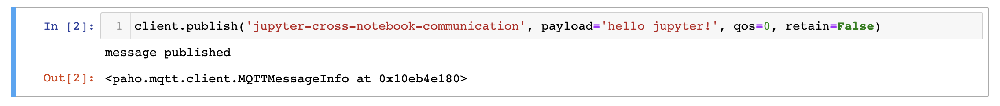
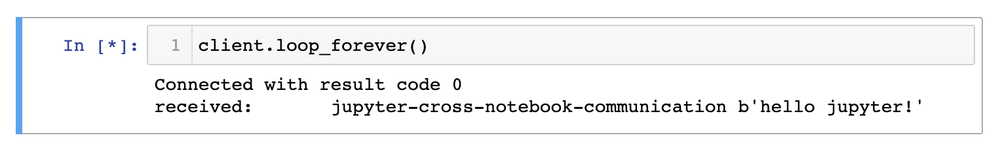
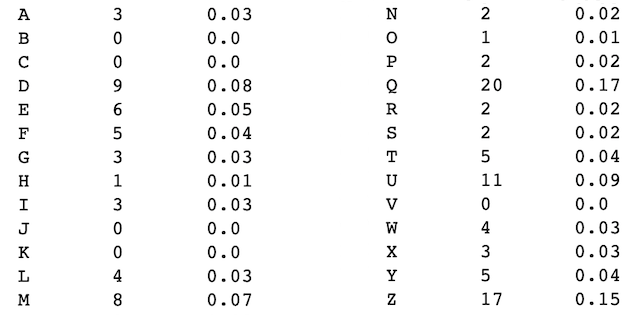
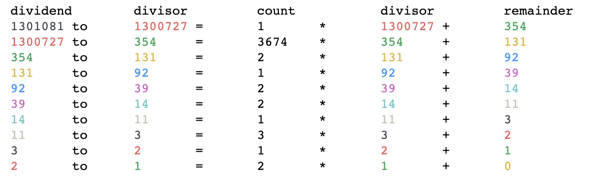

# Amalthea - notebooks for JupyterLab

<!-- vim-markdown-toc GFM -->

* [the notebooks](#the-notebooks)
  * [creative coding](#creative-coding)
    * [perlin-noise](#perlin-noise)
  * [demos](#demos)
    * [mqtt-publisher & mqtt-subscriber](#mqtt-publisher--mqtt-subscriber)
    * [frequency-analysis-caesar-cipher](#frequency-analysis-caesar-cipher)
    * [euclidean-algorithm](#euclidean-algorithm)
    * [speedtest](#speedtest)
  * [tutorials](#tutorials)
* [setup & development](#setup--development)
  * [venv](#venv)
  * [custom shortcuts and settings for JupyterLab](#custom-shortcuts-and-settings-for-jupyterlab)
  * [custom shortcuts and settings for Jupyter Notebook](#custom-shortcuts-and-settings-for-jupyter-notebook)
  * [requirement management](#requirement-management)
  * [used libraries](#used-libraries)

<!-- vim-markdown-toc -->

## the notebooks

### creative coding

#### perlin-noise


### demos

#### mqtt-publisher & mqtt-subscriber

Cross-notebook communication via MQTT.

Publishing a message:


Receiving a message from a subscribed topci:


#### frequency-analysis-caesar-cipher

Breaking a caesar ciphre by using a frequency analysis to calculate the key.




#### euclidean-algorithm

This notebooks calculates the greatest common divisor and colors numbers
to make it easier to keep track of the steps.



#### speedtest

This notebook analysis a csv file created by a script running speedtest-cli to compare internet provider speeds.


### tutorials

A series of tutorials covering Jupyter and useful libraries.

## setup & development

### venv

```sh
# initial setup:
git clone https://github.com/bmedicke/amalthea.git
cd amalthea
python3 -m venv env
source env/bin/activate
pip install -r requirements.txt

# subsequent starts:
source env/bin/activate # if not active.
jupyter notebook notebooks/

# if you don't want your browser to open add the flag: --no-browser
# to access the notebook from another device add: --ip=0.0.0.0
```

### custom shortcuts and settings for JupyterLab

### custom shortcuts and settings for Jupyter Notebook

Edit the file: `~/.jupyter/nbconfig/notebook.json`.

```json
{
  "Cell": {
    "cm_config": {
      "lineNumbers": true
    }
  },
  "keys": {
    "command": {
      "bind": {
        ";": "jupyter-notebook:run-cell",
        "?": "jupyter-notebook:show-keyboard-shortcuts",
        "ctrl-l": "jupyter-notebook:clear-cell-output",
        "g,c": "jupyter-notebook:restart-kernel-and-clear-output",
        "g,i": "jupyter-notebook:interrupt-kernel",
        "g,r": "jupyter-notebook:restart-kernel-and-run-all-cells",
        "g,s": "jupyter-notebook:shutdown-kernel",
        "h": "jupyter-notebook:scroll-notebook-up",
        "i": "jupyter-notebook:enter-edit-mode",
        "l": "jupyter-notebook:scroll-notebook-down",
        "s": "jupyter-notebook:split-cell-at-cursor",
        "shift-/": "jupyter-notebook:show-keyboard-shortcuts",
        "cmd-c": "jupyter-notebook:copy-cell",
        "ctrl-v": "jupyter-notebook:paste-cell-replace",
        "shift-j": "jupyter-notebook:extend-selection-below",
        "shift-k": "jupyter-notebook:extend-selection-above",
        "ctrl-j": "jupyter-notebook:move-cell-down",
        "ctrl-k": "jupyter-notebook:move-cell-up"
      },
      "unbind": [
        "l",
        "h",
        "i,i",
        "s"
      ]
    }
  },
  "Notebook": {
    "Header": true,
    "Toolbar": true
  }
}
```

### requirement management

**installing libraries from git repos that are not on PyPI**

```sh
pip install -e git+https://github.com/pvigier/perlin-numpy#egg=perlin-numpy
```

**updating the `requirements.txt` file after adding or updating libs**

```sh
pip freeze > requirements.txt
```

### used libraries

Most of these are in the PyPI and thus can be installed with `pip`. For the rest the pip-egg command will be listed.

* [ipympl](https://github.com/matplotlib/ipympl)
  * for `%matplotlib widget`
* [matplotlib](https://github.com/matplotlib/matplotlib)
* [paho-mqtt](https://github.com/eclipse/paho.mqtt.python)
* [pandas](https://github.com/pandas-dev/pandas)
* [perlin-numpy](https://github.com/pvigier/perlin-numpy)
  * `pip install -e git+https://github.com/pvigier/perlin-numpy#egg=perlin-numpy`
* [scipy](https://github.com/scipy/scipy)
* [seaborn](https://github.com/mwaskom/seaborn)
* [termcolor](https://pypi.org/project/termcolor/)
