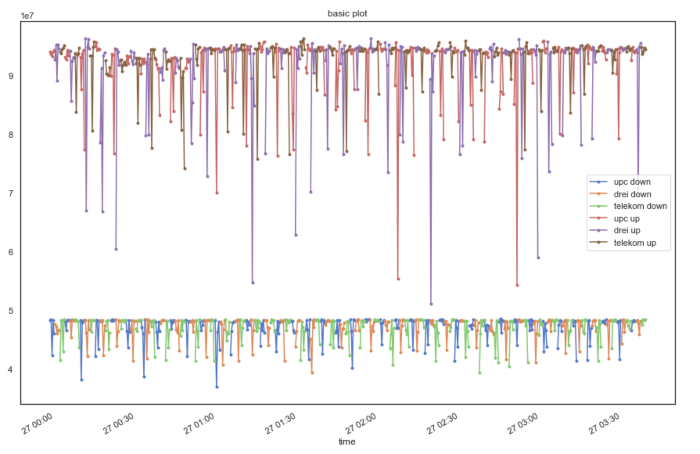
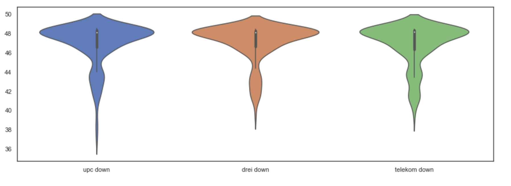

# Amalthea - collection of Jupyter notebooks


<!-- vim-markdown-toc GFM -->

* [the notebooks](#the-notebooks)
  * [creative coding](#creative-coding)
    * [perlin-noise](#perlin-noise)
  * [demos](#demos)
    * [speedtest](#speedtest)
  * [features](#features)
* [setup & development](#setup--development)
  * [venv](#venv)
  * [requirement management](#requirement-management)
  * [custom shortcuts and settings](#custom-shortcuts-and-settings)

<!-- vim-markdown-toc -->

## the notebooks

### creative coding

#### perlin-noise


### demos

#### speedtest

This notebook analysis a csv file created by a script running speedtest-cli.




### features

## setup & development

### venv

```sh
# initial setup:
git clone https://github.com/bmedicke/amalthea.git
cd amalthea
python3 -m venv env
source env/bin/activate
pip install -r requirements.txt

# subsequent starts:
source env/bin/activate # if not active.
jupyter notebook notebooks/

# if you don't want your browser to open add the flag: --no-browser
# to access the notebook from another device add: --ip=0.0.0.0
```

### requirement management

**installing libraries from git repos that are not on PyPI**

```sh
pip install -e git+https://github.com/pvigier/perlin-numpy#egg=perlin-numpy
```

**updating the `requirements.txt` file after adding or updating libs**

```sh
pip freeze > requirements.txt
```

### custom shortcuts and settings

Edit the file: `~/.jupyter/nbconfig/notebook.json`.

```json
{
  "Cell": {
    "cm_config": {
      "lineNumbers": true
    }
  },
  "keys": {
    "command": {
      "bind": {
        ";": "jupyter-notebook:run-cell",
        "?": "jupyter-notebook:show-keyboard-shortcuts",
        "ctrl-l": "jupyter-notebook:clear-cell-output",
        "g,c": "jupyter-notebook:restart-kernel-and-clear-output",
        "g,i": "jupyter-notebook:interrupt-kernel",
        "g,r": "jupyter-notebook:restart-kernel-and-run-all-cells",
        "g,s": "jupyter-notebook:shutdown-kernel",
        "h": "jupyter-notebook:scroll-notebook-up",
        "i": "jupyter-notebook:enter-edit-mode",
        "l": "jupyter-notebook:scroll-notebook-down",
        "s": "jupyter-notebook:split-cell-at-cursor",
        "shift-/": "jupyter-notebook:show-keyboard-shortcuts",
        "cmd-c": "jupyter-notebook:copy-cell",
        "ctrl-v": "jupyter-notebook:paste-cell-replace",
        "shift-j": "jupyter-notebook:extend-selection-below",
        "shift-k": "jupyter-notebook:extend-selection-above",
        "ctrl-j": "jupyter-notebook:move-cell-down",
        "ctrl-k": "jupyter-notebook:move-cell-up"
      },
      "unbind": [
        "l",
        "h",
        "i,i",
        "s"
      ]
    }
  },
  "Notebook": {
    "Header": true,
    "Toolbar": true
  }
}
```
